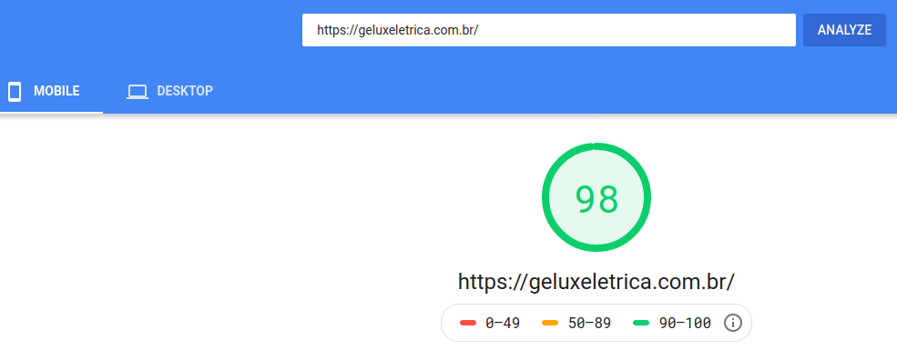

<h1 align="center">Gelux</h1>

Projeto de criação de um<strong> Site</strong> para a empresa Gelux.

## Descrição
A Gelux considera importante manter um canal de contato duradouro e de fácil acesso para se comunicar com seus clientes. Foi pensando também em fortalecer a imagem da empresa e disponibilizar informações importantes para seus clientes que o BazarDasChaves quer o desenvolvimento do seu site institucional.

## Solução
Desenvolvemos um [site](https://geluxeletrica.com.br/) para a Gelux, usando o framework Gatsby.
Segue abaixo algumas informações sobre o resultado.

> Todas as informações são baseadas na tela **Mobile** e foram tiradas do site [PageSpeedInsights](https://developers.google.com/speed/pagespeed/insights/) > - By Google

- A nota da página foi de **99** pontos.
- O tempo que o primeiro conteúdo é desenhado na tela foi de **1.9s**.
- O índice de velocidade foi de **1.9s**.
- O tempo que a página leva para ficar completamente interativa foi de **2.8s**. 

Print

PageSpeedTest BazarDasChaves                                         |  
:-----------------------------------------------------------:|
   | 

### LINKS

[PageSpeedTest BazarDasChaves](https://developers.google.com/speed/pagespeed/insights/?url=https%3A%2F%2Fgeluxeletrica.com.br%2F&tab=mobile)

